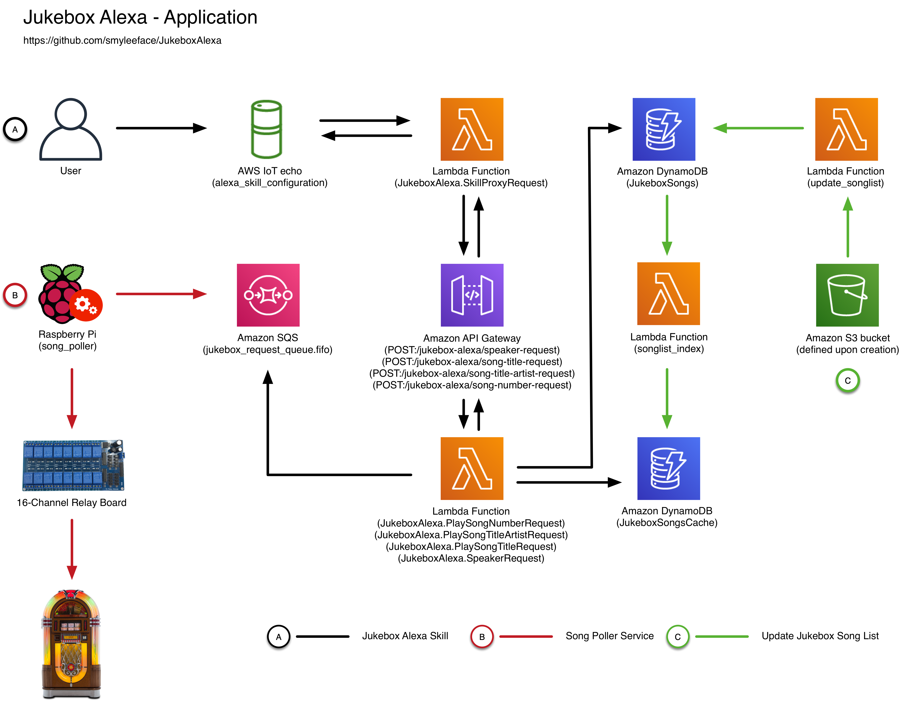

Alexa Jukebox
=============
Alexa skill that will play the song asked on the jukebox, by triggering a relay connected to a number keypad on a jukebox.



## Prerequisites
* Setup AWS Account
* Create a user, give permissions, and create user keys
* Jukebox can only be installed in regions that support:
    * SQS FIFO
    * Alexa Skill (Lambda Function)
    * DynamoDB
    * [See list of services and supported regions](https://aws.amazon.com/about-aws/global-infrastructure/regional-product-services/)
* [Docker](https://docker.com/) (optional)

## Setup

### RaspberryPi

* RaspberryPi with Raspbian installed and connected to a 16 port relay
* On both local and RaspberryPi: 
    * Download and install [python3](https://www.python.org/downloads/)
    * Install virutal env (optional)
    * Install AWS CLI `sudo pip install awscli`
    * (later) Configure AWS CLI with User keys generated by the CloudFormation template using `aws configure`

### Alexa Developer Portal

* Start a new Alexa Skill - see steps in [alexa_skill_configuration ReadMe](alexa_skill_configuration/ReadMe.md)

## Development/Deploy

### Local dotnet installation

```bash
cd <PROJECT/ROOT>
lash deploy --tier <TIER>
```

### Docker container

Use the docker container at [smyleeface/lambdasharprunner](https://hub.docker.com/r/smyleeface/lambdasharprunner/)

```bash
cd <PROJECT/ROOT>
docker pull smyleeface/lambdasharprunner
docker run -it --rm --name lambdasharprunner -v $PWD:/project -v $HOME/.aws:/root/.aws smyleeface/lambdasharprunner:latest /bin/bash lash deploy --tier <TIER>
```

## File Structure

### `alexa_skill_configuration`

Setup the Alexa skill in the developer portal.

### `cicd`

Build spec and bash files for CI/CD.

### `cloudformation`

CloudFormation templates to build the cicd infrastructure.

### `song_poller`

Python application running on the Raspberry Pi that polls for song in a queue. 

### `src/JukeboxAlexa`

C# Lambda function Alexa skill and songlist importer.


## Existing Parameters

The following parameters need to exist in the account and region before running `lash`.

* /dev/JukeboxAlexa/alexa/skillid
* /staging/JukeboxAlexa/deploy/accountid (only on staging account)
* /production/JukeboxAlexa/deploy/accountid (only on prod account)
* /dev/JukeboxAlexa/account/production (only on deploy account)
* /dev/JukeboxAlexa/account/staging (only on deploy account)
* /general/coveralls/token (only on deploy account)
